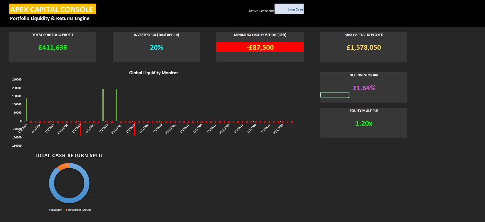

# Apex Capital Console — Case Study (Docs-only)

## Overview
An Excel-based financial modelling console with a dashboard-first UX, built to compute IRR, multi-tier ROI waterfalls, and portfolio liquidity forecasts from structured assumptions.

## What I Built
- Deterministic model layering: inputs → calculations → outputs → dashboard
- Multi-tier ROI waterfall logic and IRR cashflow engine
- Liquidity forecasting tables with scenario toggles
- Validation controls and audit-friendly structure (named ranges, traceable assumptions)

## Key Outcomes
- Faster scenario evaluation via unified KPI dashboard
- Reduced modelling errors through structured inputs and validation flags
- Improved explainability with consistent data flow and assumptions table

## Architecture Highlights
- **Model layers:** Inputs / Calc / Outputs / Dashboard
- **Controls:** validation, protected formula ranges, consistent units and time basis
- **Performance:** bounded recalculation areas, optimised formulas, reduced volatility
- **Auditability:** assumptions registry, named ranges, deterministic cashflow tables

## Docs
- [00 — Index](./docs/00-index.md)
- [01 — Workbook Architecture and Data Flow](./docs/01-workbook-architecture-and-data-flow.md)
- [02 — IRR Engine and Cashflow Conventions](./docs/02-irr-engine-and-cashflow-conventions.md)
- [03 — Waterfall Tiers and Distribution Rules](./docs/03-waterfall-tiers-and-distribution-rules.md)
- [04 — Liquidity Forecasting and Scenarios](./docs/04-liquidity-forecasting-and-scenarios.md)
- [05 — Validation, Controls, and Auditability](./docs/05-validation-controls-and-auditability.md)

## Notes
This repository is documentation-only and contains no proprietary workbook files.
